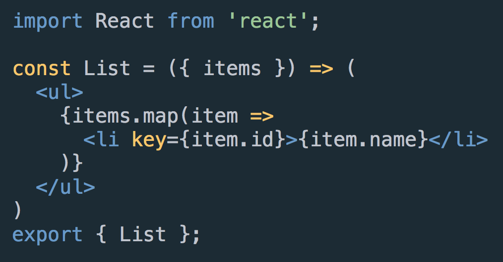
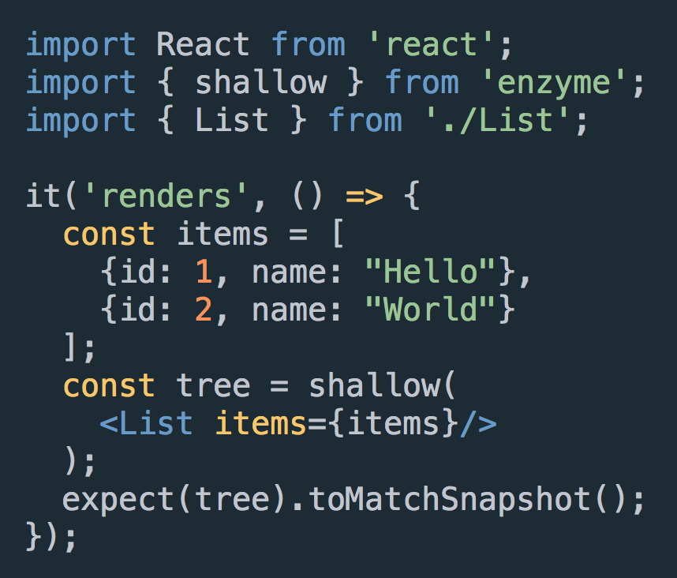
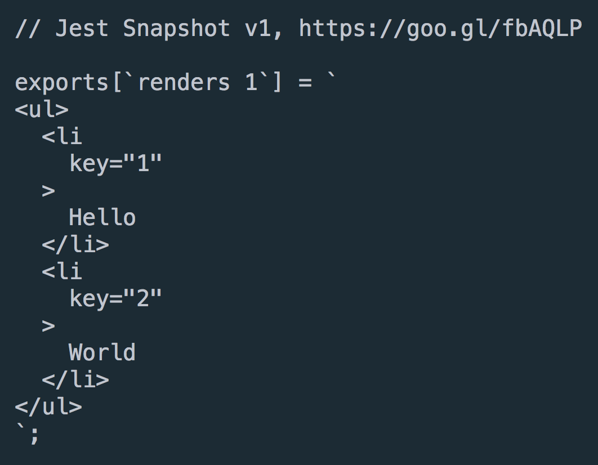
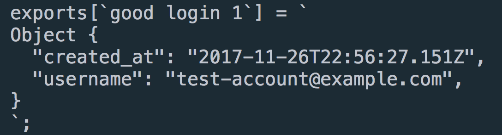
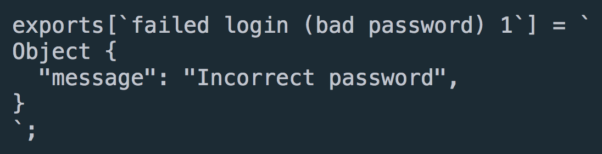
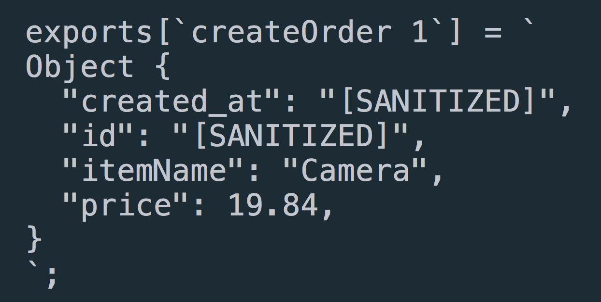

Dave Ceddia

*@dceddia*

Note:

* Hey I'm Dave Ceddia
* snapshot testing applied to APIs
* how it might be able to improve your development process

So let me set the stage here...

---

`$ git pull`

Note:

* Pull down the latest code
* Do a build, start up the app
* And the first thing you do...

---


Note:

* ...is screw up the password

---


Note:

* but instead of getting this error

---


Note:

* you get this one instead
* response from server wasn't what you expected
* you check the code; it looks right
* you check the data; it looks wrong
* so you walk over to the backend team

---


Note:

Hey guys, so, what happened to the error response on login? It's not an object anymore?

"Yeah! We changed it. We return an array now"

we told you about it in standup

---


Note:

And there was a slack message too

And your boss is like:

yeah didn't you see that message?

---


Note:

* at this point you're starting to accept that this is... probably your fault after all.

---


---


Note:

But wouldn't it be cool if you had some kind of test that could catch this error early?

like, Before it ripped your team apart?

---

## End-to-end testing?

<ul>
  <li class="fragment">Difficult to write</li>
  <li class="fragment">Brittle</li>
  <li class="fragment">Slow to run</li>
</ul>

Note:

* first thought: E2E
* aka Acceptance, Integration
* write tests w/ tool like Selenium or Nightwatch
* run them in a real browser
* value: they test the whole stack
* some downsides...

---

## Snapshot Testing!

No more broken APIs.

Note:

* nice middle ground
* tests are easy to write
* tests run fast
* Jest test framework comes with support out of the box

Show of hands:
- Who's heard of snapshot testing?
- Who's already using it?

Cool, so here's a quick overview if you're not familiar.

---

## 1. A React Component



Note:

* start off with a React component
* simple one: a List that accepts items
* renders the items

---

## 2. A Test



Note:

* then, write a test
* renders the List with some test data
* expects the rendered component to match the snapshot on disk
* first run, there is NO snapshot on disk...

---

## 3. Writes a Snapshot



Note:

* it writes out the snapshot
* test passes
* important: component should be correct before running the test!
* unless you're ok with some failures as you build out the component
* not TDD

---

## 4. Next run: Check the Snapshot

Note:

* snapshot gets checked into source control
* later test runs will compare against disk snapshot
* fail if snapshot doesn't match
* works ONCE, then KEEPS WORKING
* alerts you if broken

---

## Aside:

expect(...).toMatchSnapshot()

-----------

1. `npm install enzyme-to-json`

2. Add to package.json:

```json
"jest": {
	"snapshotSerializers": ["enzyme-to-json/serializer"]
}
```

Note:

* quick aside: toMatchSnapshot is not built into Jest
* (scroll back to usage slide)
* makes the tests a little easier to write
* easy to add

So snapshot tests are pretty cool...

---

but...

## did you know?

Note:

* but, fun fact

NEXT SLIDE

---

`expect(`

  *`any_type_you_want`*

`).toMatchSnapshot()`

* you can take snapshots of basically anything!
* not just React components
* can be objects, arrays, numbers, strings...

---


Note:

* pretty much anything
* *including* responses from your API!
* so here we go:

---

## 3 Steps To Success
<ol>
  <li class="fragment">Make an API call.</li>
  <li class="fragment">Snapshot the result.</li>
  <li class="fragment">Rest easy.</li>
</ol>


Note:

* make api call
* snapshot result
* relax, knowing the snapshot test will let you know if your API contract has been broken
* now, one thing to note....

---

## This is for real

* Real API calls
* Not mocked
* Requires a running server
* **Clean the data** between tests!

Note:

* these tests will be calling your REAL api.
* need a running server
* clean data
* test 1) lists users, test 2) creates a user
* if list expects to see 2 users returned, and data isn't being reset between test runs, it will break.

* let's look at an example

---


<!--
test('good login', async () => {
	const response = await API.login(
		'test-account@example.com',
		'supersecret!'
	);
	expect(response.data).toMatchSnapshot();
});
-->

Note:

* it makes a call to the login API
* then it expects that the response matches the snapshot
* using async/await
* the `await` just pauses on that line until the promise resolves
* then here is the snapshot...

---



Note:

* almost like running JSON.stringify on the response
* here's another example...

---


<!--
test('failed login (bad password)', async () => {
  let data;
  try {
    data = await API.login('me@example.com', 'wrong_password');
    fail();
  } catch(e) {
    expect(e.response.data).toMatchSnapshot();
  }
});
-->

Note:

* calls the same Login API
* does not care about the response
* Login call should throw an error, because login should fail
* checks the response data against the snapshot
* why data, not full response?
* full response object has lots of gory detail that you probably don't care about
* maybe check status code?
* but mainly concerned with the data
* here's the snapshot

---



Note:

* just a plain object
* with an error message
* if API starts returning arrays, this test will catch that quickly

---


* here's the success response from earlier
* notice it has a timestamp
* this could be a problem for your snapshot tests

---

## Some Things Change


Sanitize them.

<ul>
  <li class="fragment">Randomized IDs</li>
  <li class="fragment">Timestamps</li>
</ul>

Note:

* in general, watch out for things that can change
* randomized or autoincrementing IDs...
* timestamps
* anything that could change between responses
* or between test runs
* here's an example of making a request for data that will change...

---


<!--
test('createOrder', async () => {
	let order = await API.createOrder('Camera', 19.84);
	order = sanitize(order, ['id', 'created_at']);
	expect(order).toMatchSnapshot();
});
-->


Note:
* make an API call to buy a camera
* for some reason the user gets to specify the price
* the resulting order has `id` and `created_at` fields
* pass the order through sanitize function
* then expect sanitized order to match snapshot
* here's the resulting snapshot...

---



Note:

* the unstable properties have been sanitized
* so here is the sanitize function...

---


<!--
import * as _ from 'lodash';
import * as API from 'api';

function sanitize(data, keys) {
  return keys.reduce((result, key) => {
    const val = _.get(result, key);
    if(!val || _.isArray(val) || _.isObject(val)) {
      return result;
    } else {
      return _.set(_.cloneDeep(result), key, '[SANITIZED]');
    }
  }, data);
}
-->

* takes the data object, and an array of keys
* (go back to calling code)
* loops over the keys
* starts with the original data as initial value
* fetches that key
* ignores it if undefined, or a complex type
* don't want to sanitize whole objects
* sanitize the minimal amount of data
* if it finds the value, it makes a copy of the result and changes the value
* yeah, half immutable...
* uses lodash: lets you specify deeply-nested keys
* like...

---

`items[0].manufacturer.id`

Note:

* this is pretty nice
* safely handles undefined links in the chain

---

## 3 Steps To Success
<ol>
  <li class="fragment">Make an API call.</li>
  <li class="fragment">Snapshot the result.</li>
  <li class="fragment">Rest easy.</li>
</ol>

---

## Dave Ceddia

@dceddia

[daveceddia.com](https://daveceddia.com)

<div style="line-height:0;">
	
	<br/>
	<a href="purereact.com" class="pure-react-link">purereact.com</a>
</div>

<!--  -->

Note: dceddia on the interwebz. Blog about React

