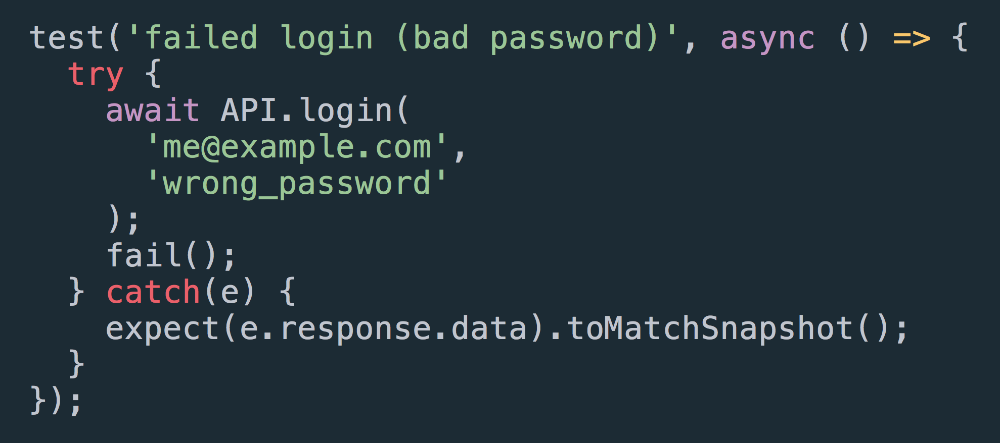

Dave Ceddia

*@dceddia*

Note:

Hey I'm Dave Ceddia, and you can probably tell from the title this is gonna have something to do with snapshot testing!

So tell me *NEXT* if this sounds familiar...

---

Tell me if this sounds familiar...

Note:
You're having a good day. *NEXT*

---

Note:
Traffic was light, you even got a seat on the train, things are looking up.

So you grab yourself a cup of coffee, and pull down the latest backend code.

---

`$ git pull`

Note:
Do a build, start everything up... **NEXT**

---

Note:
And when you go to log in, you type the password wrong.

But instead of... **NEXT** 

---

Note:
the normal error message...

---

Note:
You get this one instead.

Because for some reason the response from the server wasn't what you expected.

So you take a walk over to the backend team, and you're like...

---

Note:

Hey guys, so, what happened to the login error response? It's not an error object anymore?

And they go:

"Well we decided to return an array of errors instead of just one. You never know when you might have more than one."

---

Note: Ok, I guess...

"We TOLD you about it in standup"

And your boss is like

boss: yeah there was a Slack message too, didn't you see that?

---

Note:
So now you're wondering who's really to blame here, and starting to think it might be you.

---

---

Note:

But wouldn't it be nice if you had some tests that could catch this kind of failure?

---

## End-to-end testing?

<ul>
  <li class="fragment">Slow to write</li>
  <li class="fragment">Slow to run</li>
  <li class="fragment">Brittle</li>
  <li class="fragment">Test more than you need</li>
</ul>

Note:

E2E testing might be your first thought.

This is where you'd write tests with a tool like Selenium or Nightwatch, and run them in a real browser against a running copy of your app. But it has some downsides.

**DO BULLETS**

---

## Snapshot Testing!

No more broken APIs.

Note:
Show of hands:
- Who's heard of snapshot testing?
- Who's already using it?

Cool, so here's a quick overview if you're not familiar.

---

## 1. A React Component

img: component code

Note:

The idea is that if you have a React component like this...

---

## 2. A Test

Note:

You can write a really simple test that renders the component in memory and checks it against a snapshot.

---

## 3. Writes a Snapshot

img: snapshot file

Note:

The first time you run it, there's no saved snapshot, so the test will pass. So you want to make sure that the component is correct before you run the test!

---

## 4. Next run: Check the Snapshot

Note:

Then every time after that, when you run the test, it will compare the rendered snapshot with the one on disk, and fail the test if they don't match.

This gives you a quick way to make sure if something works ONCE, it KEEPS WORKING, and alerts you if it breaks.

---

but...

## did you know?

Note:

But: fun fact! You can take snapshots of anything!

---

`expect(`

  *`any_type_you_want`*

`).toMatchSnapshot()`

---

Note:

you can snapshot anything

including API responses

---

## 3 Steps To Success
<ol>
  <li class="fragment">Make an API call.</li>
  <li class="fragment">Snapshot the result.</li>
  <li class="fragment">Rest easy.</li>
</ol>

---

## This is for real

* Real API calls
* Not mocked
* Requires a running server
* **Clean the data** between tests!

---

<!--
test('failed login (bad password)', async () => {
  let data;
  try {
    data = await API.login('me@example.com', 'wrong_password');
    fail();
  } catch(e) {
    expect(e.response.data.error).toMatchSnapshot();
  }
});
-->

---

!! show the snapshot result !!

---

<!--
test('good login', async () => {
	const response = await API.login(
		'test-account@example.com',
		'supersecret!'
	);
	expect(response).toMatchSnapshot();
});
-->

---

!! show the snapshot result !!

---

## Some Things Change

Sanitize them.

<ul>
  <li class="fragment">Randomized IDs</li>
  <li class="fragment">Timestamps</li>
</ul>

Note:
some things change! don't let them break your tests.

Sanitize things like randomized IDs, Timestamps,
anything that might change between responses.

---

<!--
test('createOrder', async () => {
	let order = await API.createOrder('Camera', 19.84);
	order = sanitize(order, ['id', 'created_at']);
	expect(order).toMatchSnapshot();
});
-->

Note:
here's an example of testing something that changes

we make an API call to buy a camera for an ominous price

then pass the result through the *sanitize* function,
giving it an array of keys to sanitize

---

<!--
import * as _ from 'lodash';
import * as API from 'api';

function sanitize(data, keys) {
  return keys.reduce((result, key) => {
    const val = _.get(result, key);
    if(!val || _.isArray(val) || _.isObject(val)) {
      return result;
    } else {
      return _.set(_.cloneDeep(result), key, '[SANITIZED]');
    }
  }, data);
}
-->

---

## Dave Ceddia

@dceddia

[daveceddia.com](https://daveceddia.com)

<!--  -->

Note: dceddia on the interwebz. Blog about React

---

